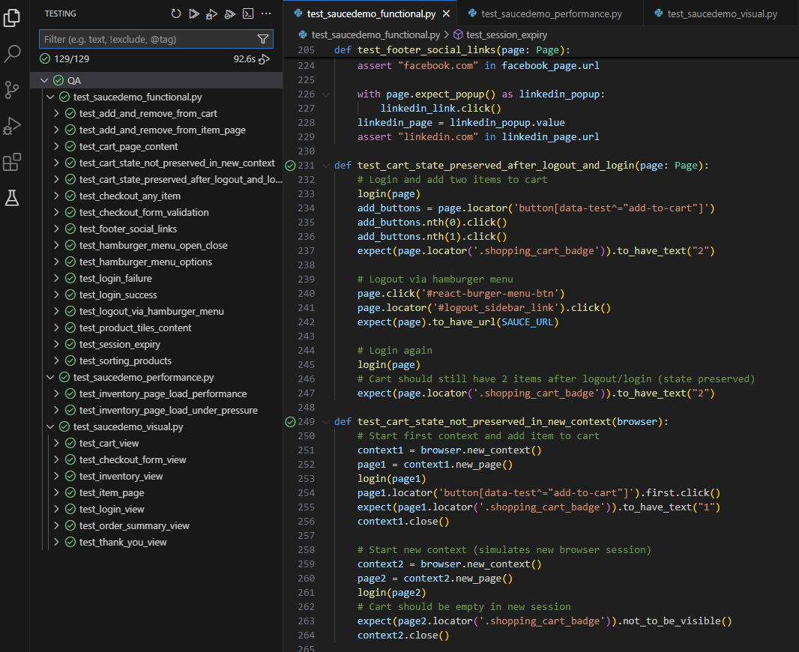
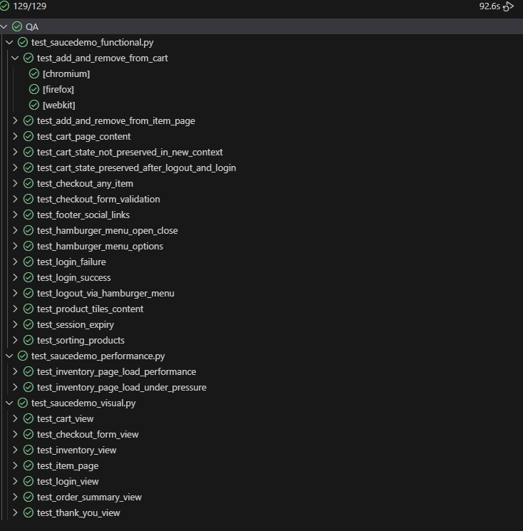
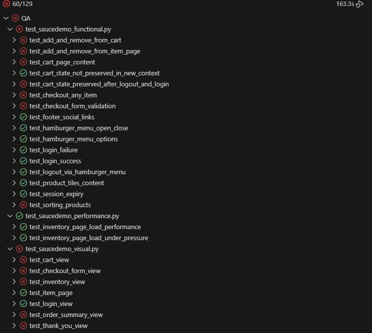
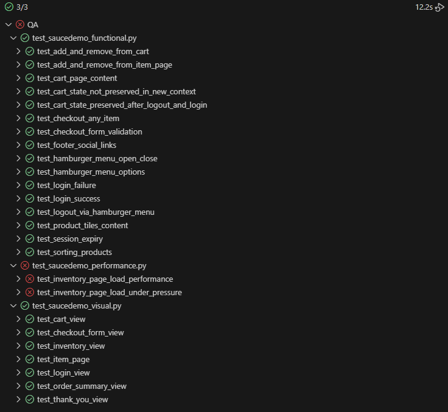
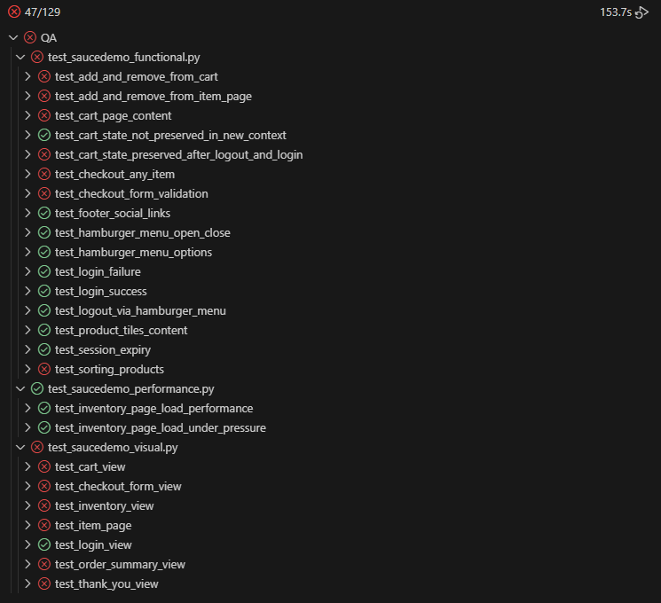
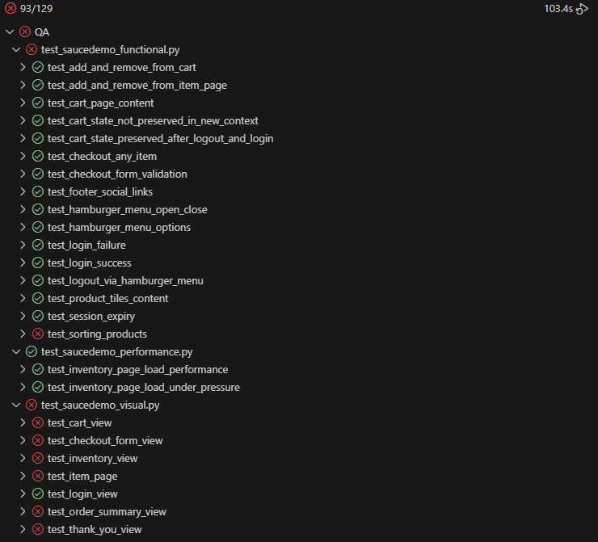

Celem projektu jest przetestowanie automatyczne aplikacji https://www.saucedemo.com/ i zredukowanie testów manualnych.
Aplikacja to prosty sklep. Po zalogowaniu wyświetla 6 produktów do kupienia w kafelkach. Każdy kafelek zawiera zdjęcie, opis, cenę oraz przycisk `Add to cart`. Po naciśnięciu przycisku zamienia się on na `Remove`.
Produkty można sortować po nazwie rosnąco i malejąco oraz po cenie rosnąco i malejąco.
Nagłówek sklepu po lewej stronie zawiera przycisk hamburger, który rozwija menu boczne z opcjami: 
- "All Items" - pozwala wrócić na listę produktów, 
- "About" - przenosi na stronę autora aplikacji, 
- "Logout" - wylogowuje i wraca na stronę logowania. 

Nagłówek sklepu po prawej stronie ma przycisk z koszykiem, przy którym wyświetla się liczba produktów w koszyku. Kliknięcie koszyka powoduje przejście do strony produktów w koszyku.
Strona koszyka to lista produktów, każdy w swoim kafelku. Kafelek zawiera pole `Quantity`, które jest nieedytowalne oraz pole `Description`. Tutaj nie ma zdjęcia produktów. W kafelku jest też przycisk `Remove` - usuwa produkt z koszyka.
Pod listą produktów są dwa przyciski: 
- `Continue shopping` - wraca na stronę produktów,
- `Checkout` - przenosi do formularza zakupu produktów. 

Formularz zakupu ma 3 pola: `First Name`, `Last Name`, `Zip/Postal code` oraz dwa przyciski: 
- `Cancel` - wraca do koszyka, 
- `Continue` - przenosi na stronę podsumowania zakupu. 

Formularz posiada walidację czy wszystkie pola zostały uzupełnione.
Strona podsumowania zakupu ma listę produktów, taką samą jak w koszyku. Pod listą znajdują się informacje o sposobie płatności, o przesyłce oraz `Total price`, `Tax`, `Total`
Strona podsumowania ma dwa przyciski: 
- `Cancel` - wraca do listy produktów do kupienia, 
- `Finish` - finalizuje zakup i przechodzi na stronę z podziękowaniem za zakupy. 

Na stronie podziękowania znajdują się statyczne teksty, podziękowanie i informacja, że przesyłka wkrótce zostanie dostarczona. Jest też przycisk `Back Home`, który przenosi na stronę główną z produktami w sklepie.
Strona zawiera cały czas widoczną stopkę w której są 3 przyciski do mediów społecznościowych - Twitter, Facebook, Linkedin.
Po pewnym czasie braku aktywności w sklepie, sesja użytkownika wygasa i dowolna akcja przenosi na stronę logowania, na której pojawia się informacja o błędzie, że sklep można przeglądać tylko po zalogowaniu się.
Po dodaniu przedmiotów do koszyka i wylogowaniu się, stan koszyka zostaje zachowany, tak że po ponownym zalogowaniu się koszyk zawiera przedmioty dodane tam przed wylogowaniem się.

Do przetestowania użyty został framework **Playwright**, testy zostały napisane w języku Python i są uruchamiane przy pomocy modułu testowania `pytest` oraz odpowiednich pluginów.


## Spis treści

  - [Przygotowanie środowiska](#przygotowanie-środowiska)
  - [Scenariusze testów funkcjonalnych](#scenariusze-testów-funkcjonalnych)
    - [1. Test logowania](#1-test-logowania)
    - [2. Test niepoprawnego logowania](#2-test-niepoprawnego-logowania)
    - [3. Test wyświetlania produktu](#3-test-wyświetlania-produktu)
    - [4. Test dodawania i usuwania produktu z koszyka](#4-test-dodawania-i-usuwania-produktu-z-koszyka)
    - [5. Test sortowania produktów](#5-test-sortowania-produktów)
    - [6. Test dodawania i usuwania produktu z koszyka z poziomu widoku szczegółów produktu](#6-test-dodawania-i-usuwania-produktu-z-koszyka-z-poziomu-widoku-szczegółów-produktu)
    - [7. Test otwierania i zamykania menu bocznego (hamburger menu)](#7-test-otwierania-i-zamykania-menu-bocznego-hamburger-menu)
    - [8. Test wylogowania w menu bocznym (hamburger menu)](#8-test-wylogowania-w-menu-bocznym-hamburger-menu)
    - [9. Test opcji w menu bocznym (hamburger menu)](#9-test-opcji-w-menu-bocznym-hamburger-menu)
    - [10. Test koszyka](#10-test-koszyka)
    - [11. Test przejścia przez proces zakupowy (checkout)](#11-test-przejścia-przez-proces-zakupowy-checkout)
    - [12. Test walidacji formularza zamówienia](#12-test-walidacji-formularza-zamówienia)
    - [13. Test wygasania sesji](#13-test-wygasania-sesji)
    - [14. Test przycisków mediów społecznościowych w stopce](#14-test-przycisków-mediów-społecznościowych-w-stopce)
    - [15. Test czy koszyk pozostaje zachowany po wylogowaniu się i ponownym zalogowaniu](#15-test-czy-koszyk-pozostaje-zachowany-po-wylogowaniu-się-i-ponownym-zalogowaniu)
    - [16. Test czy koszyk jest zachowany tylko w kontekście danej przeglądarki](#16-test-czy-koszyk-jest-zachowany-tylko-w-kontekście-danej-przeglądarki)
  - [Testy wydajnościowe](#testy-wydajnościowe)
    - [1. Test sprawdzający czas ładowania się strony z listą produktów](#1-test-sprawdzający-czas-ładowania-się-strony-z-listą-produktów)
    - [2. Test sprawdzający czas ładowania się strony z listą produktów pod większym obciążeniem](#2-test-sprawdzający-czas-ładowania-się-strony-z-listą-produktów-pod-większym-obciążeniem)
  - [Testy wizualne](#testy-wizualne)
  - [Przygotowane testy autoamtyczne Playwright](#przygotowane-testy-autoamtyczne-playwright)
    - [Testy funkcjonalne](#testy-funkcjonalne)
      - [test\_login\_success](#test_login_success)
      - [test\_login\_failure](#test_login_failure)
      - [test\_product\_tiles\_content](#test_product_tiles_content)
      - [test\_add\_and\_remove\_from\_cart](#test_add_and_remove_from_cart)
      - [test\_sorting\_products](#test_sorting_products)
      - [test\_add\_and\_remove\_from\_item\_page](#test_add_and_remove_from_item_page)
      - [test\_hamburger\_menu\_open\_close](#test_hamburger_menu_open_close)
      - [test\_logout\_via\_hamburger\_menu](#test_logout_via_hamburger_menu)
      - [test\_hamburger\_menu\_options](#test_hamburger_menu_options)
      - [test\_cart\_page\_content](#test_cart_page_content)
      - [test\_checkout\_any\_item](#test_checkout_any_item)
      - [test\_checkout\_form\_validation](#test_checkout_form_validation)
      - [test\_session\_expiry](#test_session_expiry)
      - [test\_footer\_social\_links](#test_footer_social_links)
      - [test\_cart\_state\_preserved\_after\_logout\_and\_login](#test_cart_state_preserved_after_logout_and_login)
      - [test\_cart\_state\_not\_preserved\_in\_new\_context](#test_cart_state_not_preserved_in_new_context)
    - [Testy wydajnościowe](#testy-wydajnościowe-1)
      - [test\_inventory\_page\_load\_performance](#test_inventory_page_load_performance)
      - [test\_inventory\_page\_load\_under\_pressure](#test_inventory_page_load_under_pressure)
    - [Testy wizualne](#testy-wizualne-1)
      - [test\_login\_view](#test_login_view)
      - [test\_inventory\_view](#test_inventory_view)
      - [test\_item\_page](#test_item_page)
      - [test\_cart\_view](#test_cart_view)
      - [test\_checkout\_form\_view](#test_checkout_form_view)
      - [test\_order\_summary\_view](#test_order_summary_view)
      - [test\_thank\_you\_view](#test_thank_you_view)
  - [Uruchamianie testów dla różnych użytkowników](#uruchamianie-testów-dla-różnych-użytkowników)
    - [standard\_user](#standard_user)
    - [problem\_user](#problem_user)
    - [performance\_glitch\_user](#performance_glitch_user)
    - [error\_user](#error_user)
    - [visual\_user](#visual_user)


## Przygotowanie środowiska

Środowisko do testowania zostało przygotowane w programie Visual Studio Code. Językiem programowania użytym w testach jest Python w wersji 3.13.3. 
Do uruchamiania testów użyto biblioteki `pytest` oraz `Playwright` wraz z pluginem `pytest-playwright`.
Aby testy były uruchamiane jednoczesnie w tym samym czasie doinstalowany został plugin `pytest-xdist`.
Do testów z porównaniem wizualnym dodany został plugin `pytest-playwright-visual`. 
Po zainstalowaniu wszystkich elementów i pluginów w programie VSCode oraz po dodaniu niezbędnych konfiguracji, na zakładce Testing można uruchamiać testy i sprawdzać ich status.



## Scenariusze testów funkcjonalnych

### 1. Test logowania
- **Opis:** Sprawdza, czy użytkownik może się poprawnie zalogować oraz czy po zalogowaniu wyświetla się lista 6 produktów.
- **Kroki:**
  1. Otwórz stronę logowania.
  2. Wprowadź poprawne dane logowania.
  3. Kliknij "Login".
  4. Sprawdź, czy wyświetla się lista 6 produktów.

---

### 2. Test niepoprawnego logowania
- **Opis:** Sprawdza, czy pojawia się komunikat o błędzie przy niepoprawnych danych logowania.
- **Kroki:**
  1. Otwórz stronę logowania.
  2. Wprowadź niepoprawne dane.
  3. Kliknij "Login".
  4. Sprawdź, czy pojawia się komunikat o błędzie.

---

### 3. Test wyświetlania produktu
- **Opis:** Sprawdza, czy każdy produkt na liście zawiera zdjęcie, opis, cenę i przycisk "Add to cart".
- **Kroki:**
  1. Zaloguj się.
  2. Sprawdź, czy każdy z 6 produktów ma zdjęcie, opis, cenę i przycisk "Add to cart".

---

### 4. Test dodawania i usuwania produktu z koszyka
- **Opis:** Sprawdza, czy po kliknięciu "Add to cart" przycisk zmienia się na "Remove" i liczba produktów w koszyku się zwiększa.
- **Kroki:**
  1. Zaloguj się.
  2. Kliknij "Add to cart" przy każdym produkcie.
  3. Sprawdź, czy przycisk zmienił się na "Remove".
  4. Sprawdź, czy liczba produktów w koszyku wzrosła o 1.
  5. Kliknij każde "Remove".
  6. Sprawdź, czy liczba produktów w koszyku spadła.

---

### 5. Test sortowania produktów
- **Opis:** Sprawdza, czy sortowanie po nazwie i cenie działa poprawnie.
- **Kroki:**
  1. Zaloguj się.
  2. Przetestuj sortowanie po nazwie rosnąco i malejąco.
  3. Przetestuj sortowanie po cenie rosnąco i malejąco.
  4. Sprawdź, czy produkty są posortowane zgodnie z wybraną opcją.

---

### 6. Test dodawania i usuwania produktu z koszyka z poziomu widoku szczegółów produktu
- **Opis:** Sprawdza, czy po kliknięciu "Add to cart" przycisk zmienia się na "Remove" i liczba produktów w koszyku się zwiększa.
- **Kroki:**
  1. Zaloguj się.
  2. Przejdz na stronę szczegółów produktu.
  3. Sprawdź czy jest widoczny przycisk "Add to cart".
  4. Kliknij przycisk "Add to cart".
  5. Sprawdź, czy przycisk zmienił się na "Remove".
  6. Sprawdź, czy liczba produktów w koszyku jest równa 1.
  7. Kliknij przycisk "Remove".
  8. Sprawdź, czy liczba produktów w koszyku jest równa 0.
  9. Powtóz dla każdego istniejącego produktu.

---

### 7. Test otwierania i zamykania menu bocznego (hamburger menu)
- **Opis:** Sprawdza, czy menu boczne otwiera się i zamyka poprawnie.
- **Kroki:**
  1. Zaloguj się.
  2. Kliknij hamburger menu.
  3. Sprawdź obecność przycisku do zamknięcia.
  4. Kliknij przycisk zamykania
  5. Sprawdź czy przycisk hamburger jest widoczny

---

### 8. Test wylogowania w menu bocznym (hamburger menu)
- **Opis:** Sprawdza, czy menu boczne zawiera opcję wylogowania i czy wylogowanie działa poprawnie.
- **Kroki:**
  1. Zaloguj się.
  2. Kliknij hamburger menu.
  3. Sprawdź obecność opcji: "Logout".
  4. Naciśnij "Logout"
  5. Sprawdź czy aplikacja wyświetla stronę logowania
  6. Sprawdź czy nie dą się przejść na stronę produktów bez logowania
  7. Sprawdź czy wyświetla się odpowiedni błąd

---

### 9. Test opcji w menu bocznym (hamburger menu)
- **Opis:** Sprawdza, czy menu boczne zawiera odpowiednie opcje oraz czy każda opcja działa poprawnie.
- **Kroki:**
  1. Zaloguj się.
  2. Przejdź na stronę koszyka.
  3. Kliknij hamburger menu.
  4. Sprawdź obecność opcji: "All Items".
  5. Kliknij "All Items".
  6. Sprawdź czy strona zmieniła się na "Inventory"
  7. Kliknij hamburger menu
  8. Sprawdź obecność opcji: "About".
  9. Kliknij "About"
  10. Sprawdź czy adres strony zmienił się na: saucelabs.com

---

### 10. Test koszyka
- **Opis:** Sprawdza, czy po dodaniu produktów do koszyka są one poprawnie wyświetlane na stronie koszyka.
- **Kroki:**
  1. Zaloguj się.
  2. Dodaj produkty do koszyka.
  3. Kliknij ikonę koszyka.
  4. Sprawdź, czy produkty są wyświetlane z odpowiednią ilością i opisem.
  5. Sprawdź, czy przycisk "Remove" usuwa produkt z koszyka.

---

### 11. Test przejścia przez proces zakupowy (checkout)
- **Opis:** Sprawdza, czy można przejść przez cały proces zakupu dla każdego produktu.
- **Kroki:**
  1. Zaloguj się.
  2. Dodaj produkt do koszyka.
  3. Przejdź do koszyka.
  4. Kliknij "Checkout".
  5. Wypełnij formularz (First Name, Last Name, Zip/Postal code).
  6. Kliknij "Continue".
  7. Sprawdź podsumowanie zamówienia.
  8. Kliknij "Finish".
  9. Sprawdź, czy pojawia się strona z podziękowaniem i przycisk "Back Home" działa.
  10. Dopóki sa produkty do sprawdzenia, dodaj kolejny produkt i przejdź do punktu 3.

---

### 12. Test walidacji formularza zamówienia
- **Opis:** Sprawdza, czy formularz zamówienia wymaga uzupełnienia wszystkich pól.
- **Kroki:**
  1. Zaloguj się.
  2. Dodaj produkt do koszyka i przejdź do checkout.
  3. Spróbuj przejść dalej bez wypełniania pól lub wypełnij tylko część.
  4. Sprawdź, czy pojawia się odpowiedni komunikat o błędzie.

---

### 13. Test wygasania sesji
- **Opis:** Sprawdza, czy po dłuższym braku aktywności sesja wygasa i każda akcja przenosi na stronę logowania z komunikatem o błędzie.
- **Kroki:**
  1. Zaloguj się.
  2. Odczekaj wymagany czas bez aktywności.
  3. Spróbuj wykonać dowolną akcję.
  4. Sprawdź, czy następuje przekierowanie na stronę logowania z komunikatem błędu.

---

### 14. Test przycisków mediów społecznościowych w stopce
- **Opis:** Sprawdza, czy przyciski do Twittera, Facebooka i Linkedina są widoczne i prowadzą do odpowiednich stron.
- **Kroki:**
  1. Zaloguj się.
  2. Sprawdź obecność przycisków w stopce.
  3. Kliknij każdy z nich i sprawdź, czy otwiera się odpowiednia strona w nowej karcie.

---

### 15. Test czy koszyk pozostaje zachowany po wylogowaniu się i ponownym zalogowaniu
- **Opis:** Sprawdza, czy po dodaniu przedmiotów do koszyka i wylogowaniu się, produkty pozostają w koszyku po ponownym zalogowaniu tego samego użytkownika
- **Kroki:**
  1. Zaloguj się.
  2. Dodaj produkty do koszyka.
  3. Wyloguj się.
  4. Ponownie się zaloguj.
  5. Sprawdź czy koszyk ciągle zawiera dodane produkty.

---

### 16. Test czy koszyk jest zachowany tylko w kontekście danej przeglądarki
- **Opis:** Sprawdza, czy koszyk zachowuje swój stan tylko w kontekście przeglądarki. Uruchomienie sklepu na innej przeglądarce lub komputerze nie przywraca stanu koszyka z innej maszyny.
- **Kroki:**
  1. Zaloguj się.
  2. Dodaj produkty do koszyka.
  3. Wyloguj się.
  4. Uruchom inny context (incognito lub inną przeglądarkę) 
  5. Sprawdź czy koszyk jest pusty

---

## Testy wydajnościowe

Zaprojektowane zostały dwa testy wydajnościowe, które sprawdzają czasy ładowania się sklepu po zalogowaniu użytkownia.
Te testy powinny być uruchamiane jeden po drugim, osobno dla każdej przeglądarki. Testy sprawdzają czas załadowania się strony testowej hostowanej na serwerze. Jeśli testy są uruchamiane współbieżnie może to wpłynąć na czas ładowania się strony.

### 1. Test sprawdzający czas ładowania się strony z listą produktów
- **Opis:** Sprawdza ile trwa załadowanie się strony z listą produktów po zalogowaniu pojedyńczego użytkownika.

### 2. Test sprawdzający czas ładowania się strony z listą produktów pod większym obciążeniem
- **Opis:** Sprawdza ile trwa załadowanie się strony z listą produktów przy jednoczesnym zalogowaniu się wielu użytkowników. Z uwagi na to, że testowana strona to demo udostępnione publicznie w internecie, wydajność nie jest zbyt duża, dlatego liczba użytkowników została ustawiona na 5.

---

## Testy wizualne

Każda strona produktu i wszystkie strony sklepu posiadają swoje testy wizualne. Przy pierwszym uruchomieniu testy tworzą referencyjny screenshot i kończą się negatywnie. Obrazki są zapisywane w katalogu `snapshots/test_saucedemo_visual`. Każde kolejne uruchomienie testu robi screenshot i porównuje go z tym referencyjnym. Jeśli obrazy różnią się od siebie to test kończy się negatywnie, a w odpowiednim katalogu zapisują się trzy obrazy: źródłowy do porównania, zrobiony w aktualnym teście oraz obraz pokazujący różnicę między nimi.

## Przygotowane testy autoamtyczne Playwright

### Testy funkcjonalne

#### test_login_success
**Opis:**  
Sprawdza, czy użytkownik może poprawnie się zalogować oraz czy po zalogowaniu wyświetla się lista 6 produktów.

**Kod:**
```python
def test_login_success(page: Page):
    login(page)
    expect(page.locator('.inventory_item')).to_have_count(6)
```

---

#### test_login_failure
**Opis:**  
Sprawdza, czy pojawia się komunikat o błędzie przy niepoprawnych danych logowania.

**Kod:**
```python
def test_login_failure(page: Page):
    page.goto(SAUCE_URL)
    page.fill('input[data-test="username"]', "wrong_user")
    page.fill('input[data-test="password"]', "wrong_pass")
    page.click('input[data-test="login-button"]')
    expect(page.locator('[data-test="error"]')).to_be_visible()
```

---

#### test_product_tiles_content
**Opis:**  
Sprawdza, czy każdy produkt na liście zawiera zdjęcie, opis, cenę i przycisk "Add to cart".

**Kod:**
```python
def test_product_tiles_content(page: Page):
    login(page)
    items = page.locator('.inventory_item')
    expect(items).to_have_count(6)
    for i in range(6):
        item = items.nth(i)
        expect(item.locator('img.inventory_item_img')).to_be_visible()
        expect(item.locator('.inventory_item_desc')).to_be_visible()
        expect(item.locator('.inventory_item_price')).to_be_visible()
        expect(item.locator('button')).to_have_text("Add to cart")
```

---

#### test_add_and_remove_from_cart
**Opis:**  
Sprawdza, czy po kliknięciu "Add to cart" przycisk zmienia się na "Remove" i liczba produktów w koszyku się zwiększa, a po usunięciu zmniejsza.

**Kod:**
```python
def test_add_and_remove_from_cart(page: Page):
    login(page)
    add_buttons = page.locator('button[data-test^="add-to-cart"]')
    expect(add_buttons).to_have_count(6)
    
    expect(page.locator('.shopping_cart_badge')).not_to_be_visible()

    for i in range(6):
        expect(add_buttons.first).to_have_text("Add to cart")
        add_buttons.first.click()
        expect(page.locator('.shopping_cart_badge')).to_have_text(f"{i + 1}")

    remove_buttons = page.locator('button[data-test^="remove"]')
    expect(remove_buttons).to_have_count(6)

    for i in range(6):
        expect(remove_buttons.first).to_have_text("Remove")
        remove_buttons.first.click()
        if i < 5:
            expect(page.locator('.shopping_cart_badge')).to_have_text(f"{(5 - i)}")

    expect(page.locator('.shopping_cart_badge')).not_to_be_visible()
```

---

#### test_sorting_products
**Opis:**  
Sprawdza, czy sortowanie po nazwie i cenie działa poprawnie.

**Kod:**
```python
def test_sorting_products(page: Page):
    login(page)
    sort_select = page.locator('[data-test="product-sort-container"]')
    sort_select.select_option("az")
    names = page.locator('.inventory_item_name').all_text_contents()
    assert names == sorted(names)
    sort_select.select_option("za")
    names = page.locator('.inventory_item_name').all_text_contents()
    assert names == sorted(names, reverse=True)
    sort_select.select_option("lohi")
    prices = [float(p[1:]) for p in page.locator('.inventory_item_price').all_text_contents()]
    assert prices == sorted(prices)
    sort_select.select_option("hilo")
    prices = [float(p[1:]) for p in page.locator('.inventory_item_price').all_text_contents()]
    assert prices == sorted(prices, reverse=True)
```

---

#### test_add_and_remove_from_item_page
**Opis:**  
Sprawdza, czy można dodać i usunąć produkt z koszyka z poziomu strony szczegółów produktu.

**Kod:**
```python
@pytest.mark.parametrize("item", [(0), (1), (2), (3), (4), (5)])
def test_add_and_remove_from_item_page(page: Page, item):
    login(page)
    page.goto(f"{SAUCE_URL}inventory-item.html?id={item}")

    add_button = page.locator('button[data-test^="add-to-cart"]').first
    expect(add_button).to_have_text("Add to cart")
    add_button.click()
    expect(page.locator('.shopping_cart_badge')).to_have_text("1")

    remove_button = page.locator('button[data-test^="remove"]').first
    expect(remove_button).to_have_text("Remove")
    remove_button.click()
    expect(page.locator('.shopping_cart_badge')).not_to_be_visible()
```

---

#### test_hamburger_menu_open_close
**Opis:**  
Sprawdza, czy menu boczne otwiera się i zamyka poprawnie.

**Kod:**
```python
def test_hamburger_menu_open_close(page: Page):
    login(page)
    page.click('#react-burger-menu-btn')
    expect(page.locator('#react-burger-cross-btn')).to_be_visible()
    page.click('#react-burger-cross-btn')
    expect(page.locator('#react-burger-menu-btn')).to_be_visible()
```

---

#### test_logout_via_hamburger_menu
**Opis:**  
Sprawdza, czy opcja wylogowania w menu bocznym działa poprawnie i czy po wylogowaniu nie można wejść na stronę produktów.

**Kod:**
```python
def test_logout_via_hamburger_menu(page: Page):
    login(page)
    page.click('#react-burger-menu-btn')
    logout_link = page.locator('#logout_sidebar_link').first
    expect(logout_link).to_be_visible()
    logout_link.click()
    expect(page).to_have_url(SAUCE_URL)
    page.goto(SAUCE_URL + "inventory.html")
    error_element = page.locator('[data-test="error"]').first
    expect(error_element).to_be_visible()
    expect(error_element).to_have_text("Epic sadface: You can only access '/inventory.html' when you are logged in.")
```

---

#### test_hamburger_menu_options
**Opis:**  
Sprawdza, czy menu boczne zawiera odpowiednie opcje oraz czy każda opcja działa poprawnie.

**Kod:**
```python
def test_hamburger_menu_options(page: Page):
    login(page)
    page.click('.shopping_cart_link')
    expect(page).to_have_url(re.compile("cart.html"))

    page.click('#react-burger-menu-btn')
    expect(page.locator('#inventory_sidebar_link')).to_be_visible()
    page.click('#inventory_sidebar_link')
    expect(page).to_have_url(re.compile("inventory"))

    page.click('#react-burger-menu-btn')
    page.click('#about_sidebar_link')
    expect(page).to_have_url(re.compile("saucelabs.com"))
```

---

#### test_cart_page_content
**Opis:**  
Sprawdza, czy po dodaniu produktów do koszyka są one poprawnie wyświetlane na stronie koszyka i czy można je usunąć.

**Kod:**
```python
def test_cart_page_content(page: Page):
    login(page)
    add_all_items_to_cart(page)
    page.click('.shopping_cart_link')
    cart_items = page.locator('[data-test=inventory-item]')
    expect(cart_items).to_have_count(6)
    for item in cart_items.all():
        expect(item.locator('[data-test=inventory-item-name]')).to_be_visible()
        expect(item.locator('[data-test=inventory-item-desc]')).to_be_visible()
        expect(item.locator('[data-test=inventory-item-price]')).to_be_visible()
        expect(item.locator('[data-test=item-quantity]')).to_have_text("1")
        expect(item.locator('button[data-test^="remove"]')).to_have_text("Remove")
    remove_all_items_from_cart(page)
    expect(cart_items).not_to_be_visible()
```

---

#### test_checkout_any_item
**Opis:**  
Sprawdza, czy można przejść przez cały proces zakupu dla każdego produktu.

**Kod:**
```python
@pytest.mark.parametrize("item", [(0), (1), (2), (3), (4), (5)])
def test_checkout_any_item(page: Page, item):
    login(page)
    page.locator('button[data-test^="add-to-cart"]').nth(item).click()
    page.click('.shopping_cart_link')
    page.click('button[data-test="checkout"]')
    page.fill('input[data-test="firstName"]', "Jan")
    page.fill('input[data-test="lastName"]', "Kowalski")
    page.fill('input[data-test="postalCode"]', "00-001")
    page.click('input[data-test="continue"]')
    expect(page.locator('.summary_info')).to_be_visible()
    page.click('button[data-test="finish"]')
    expect(page.locator('.complete-header')).to_have_text("Thank you for your order!")
    page.click('button[data-test="back-to-products"]')
    expect(page).to_have_url(re.compile("inventory"))
```

---

#### test_checkout_form_validation
**Opis:**  
Sprawdza, czy formularz zamówienia wymaga uzupełnienia wszystkich pól i wyświetla odpowiedni komunikat o błędzie.

**Kod:**
```python
@pytest.mark.parametrize("customer, result", [
    ({'fn': '', 'ln': '', 'c': ''}, {'valid': 'false', 'error': "Error: First Name is required" }), 
    ({'fn': "Jan", 'ln': '', 'c': ''}, {'valid': 'false', 'error': "Error: Last Name is required" }), 
    ({'fn': "Jan", 'ln': "Kowalski", 'c': ''}, {'valid': 'false', 'error': "Error: Postal Code is required" }),
    ({'fn': "Jan", 'ln': "Kowalski", 'c': '00-001'}, {'valid': 'true', 'error': "" })
])
def test_checkout_form_validation(page: Page, customer, result):
    login(page)
    page.locator('button[data-test^="add-to-cart"]').first.click()
    page.click('.shopping_cart_link')
    page.click('button[data-test="checkout"]')

    page.fill('input[data-test="firstName"]', customer['fn'])
    page.fill('input[data-test="lastName"]', customer['ln'])
    page.fill('input[data-test="postalCode"]', customer['c'])

    page.click('input[data-test="continue"]')

    error_element = page.locator('[data-test="error"]')
    
    if result['valid'] == 'false':
        expect(error_element).to_be_visible()
        expect(error_element).to_have_text(result['error'])
    else:
        expect(error_element).not_to_be_visible()
        expect(page.locator('.summary_info')).to_be_visible()
```

---

#### test_session_expiry
**Opis:**  
Sprawdza, czy po wygaśnięciu sesji użytkownik zostaje przekierowany na stronę logowania z komunikatem o błędzie.

**Kod:**
```python
def test_session_expiry(page: Page):
    login(page)
    page.context.clear_cookies()
    page.reload()
    expect(page).to_have_url(SAUCE_URL)
    expect(page.locator('[data-test="error"]')).to_be_visible()
```

---

#### test_footer_social_links
**Opis:**  
Sprawdza, czy przyciski do Twittera, Facebooka i Linkedina są widoczne i prowadzą do odpowiednich stron.

**Kod:**
```python
def test_footer_social_links(page: Page):
    login(page)

    twitter_link = page.locator('a[href*="twitter.com"]')
    facebook_link = page.locator('a[href*="facebook.com"]')
    linkedin_link = page.locator('a[href*="linkedin.com"]')

    expect(twitter_link).to_be_visible()
    expect(facebook_link).to_be_visible()
    expect(linkedin_link).to_be_visible()
    
    with page.expect_popup() as twitter_popup:
        twitter_link.click()
    twitter_page = twitter_popup.value
    assert "x.com" in twitter_page.url

    with page.expect_popup() as facebook_popup:
        facebook_link.click()
    facebook_page = facebook_popup.value
    assert "facebook.com" in facebook_page.url

    with page.expect_popup() as linkedin_popup:
        linkedin_link.click()
    linkedin_page = linkedin_popup.value
    assert "linkedin.com" in linkedin_page.url
```

---

#### test_cart_state_preserved_after_logout_and_login
**Opis:**  
Sprawdza, czy po wylogowaniu i ponownym zalogowaniu koszyk zachowuje dodane produkty.

**Kod:**
```python
def test_cart_state_preserved_after_logout_and_login(page: Page):
    login(page)
    add_buttons = page.locator('button[data-test^="add-to-cart"]')
    add_buttons.nth(0).click()
    add_buttons.nth(1).click()
    expect(page.locator('.shopping_cart_badge')).to_have_text("2")

    page.click('#react-burger-menu-btn')
    page.locator('#logout_sidebar_link').click()
    expect(page).to_have_url(SAUCE_URL)

    login(page)
    expect(page.locator('.shopping_cart_badge')).to_have_text("2")
```

---

#### test_cart_state_not_preserved_in_new_context
**Opis:**  
Sprawdza, czy koszyk jest pusty w nowym kontekście przeglądarki (np. incognito).

**Kod:**
```python
def test_cart_state_not_preserved_in_new_context(browser):
    context1 = browser.new_context()
    page1 = context1.new_page()
    login(page1)
    page1.locator('button[data-test^="add-to-cart"]').first.click()
    expect(page1.locator('.shopping_cart_badge')).to_have_text("1")
    context1.close()

    context2 = browser.new_context()
    page2 = context2.new_page()
    login(page2)
    expect(page2.locator('.shopping_cart_badge')).not_to_be_visible()
    context2.close()
```

---

### Testy wydajnościowe

#### test_inventory_page_load_performance
**Opis:**  
Sprawdza czas ładowania się strony z listą produktów po zalogowaniu pojedynczego użytkownika.

**Kod:**
```python
@pytest.mark.xdist_group(name="group_serial")
def test_inventory_page_load_performance(page: Page):
    login(page)
    start_time = time.time()
    page.wait_for_selector('.inventory_list', timeout=MAX_LOAD_TIME * 1000)
    load_time = time.time() - start_time

    assert load_time <= MAX_LOAD_TIME, f"Inventory page load time {load_time:.2f}s exceeds threshold {MAX_LOAD_TIME}s"
```

---

#### test_inventory_page_load_under_pressure
**Opis:**  
Sprawdza czas ładowania się strony z listą produktów przy jednoczesnym zalogowaniu się wielu użytkowników.

**Kod:**
```python
@pytest.mark.xdist_group(name="group_serial")
def test_inventory_page_load_under_pressure(browser_type):

    NUM_USERS = 5
    results = []

    with ThreadPoolExecutor(max_workers=NUM_USERS) as executor:
        futures = [executor.submit(load_inventory, browser_type.name) for _ in range(NUM_USERS)]
        for future in as_completed(futures):
            results.append(future.result())

    for idx, load_time in enumerate(results):
        assert load_time <= MAX_LOAD_TIME, (
            f"User {idx+1}: Inventory page load time {load_time:.2f}s exceeds threshold {MAX_LOAD_TIME}s"
        )
```

---

### Testy wizualne

#### test_login_view
**Opis:**  
Test wizualny strony logowania – porównuje aktualny wygląd z referencyjnym screenshotem.

**Kod:**
```python
def test_login_view(page: Page, assert_snapshot):
    page.goto(SAUCE_URL)
    assert_snapshot(page.screenshot(full_page=True))
```

---

#### test_inventory_view
**Opis:**  
Test wizualny strony z listą produktów – porównuje aktualny wygląd z referencyjnym screenshotem.

**Kod:**
```python
def test_inventory_view(page: Page, assert_snapshot):
    login(page)
    page.wait_for_selector('.inventory_item_img')
    assert_snapshot(page.screenshot(full_page=True))
```

---

#### test_item_page
**Opis:**  
Test wizualny strony szczegółów produktu – porównuje aktualny wygląd z referencyjnym screenshotem.

**Kod:**
```python
@pytest.mark.parametrize("item", [(0), (1), (2), (3), (4), (5)])
def test_item_page(page: Page, assert_snapshot, item):
    login(page)
    page.goto(f"{SAUCE_URL}inventory-item.html?id={item}")
    page.wait_for_selector('.inventory_details_img')
    assert_snapshot(page.screenshot(full_page=True))
```

---

#### test_cart_view
**Opis:**  
Test wizualny strony koszyka – porównuje aktualny wygląd z referencyjnym screenshotem.

**Kod:**
```python
def test_cart_view(page: Page, assert_snapshot):
    login(page)
    add_all_items_to_cart(page)
    page.click('.shopping_cart_link')
    page.wait_for_selector('.cart_list')
    assert_snapshot(page.screenshot(full_page=True))
```

---

#### test_checkout_form_view
**Opis:**  
Test wizualny formularza zamówienia – porównuje aktualny wygląd z referencyjnym screenshotem.

**Kod:**
```python
def test_checkout_form_view(page: Page, assert_snapshot):
    login(page)
    add_all_items_to_cart(page)
    page.click('.shopping_cart_link')
    page.click('button[data-test="checkout"]')
    page.wait_for_selector('input[data-test="firstName"]')
    assert_snapshot(page.screenshot(full_page=True))
```

---

#### test_order_summary_view
**Opis:**  
Test wizualny podsumowania zamówienia – porównuje aktualny wygląd z referencyjnym screenshotem.

**Kod:**
```python
def test_order_summary_view(page: Page, assert_snapshot):
    login(page)
    add_all_items_to_cart(page)
    page.click('.shopping_cart_link')
    page.click('button[data-test="checkout"]')
    page.fill('input[data-test="firstName"]', 'Test')
    page.fill('input[data-test="lastName"]', 'User')
    page.fill('input[data-test="postalCode"]', '12345')
    page.click('input[data-test="continue"]')
    page.wait_for_selector('.summary_info')
    assert_snapshot(page.screenshot(full_page=True))
```

---

#### test_thank_you_view
**Opis:**  
Test wizualny strony z podziękowaniem za zakupy – porównuje aktualny wygląd z referencyjnym screenshotem.

**Kod:**
```python
def test_thank_you_view(page: Page, assert_snapshot):
    login(page)
    add_all_items_to_cart(page)
    page.click('.shopping_cart_link')
    page.click('button[data-test="checkout"]')
    page.fill('input[data-test="firstName"]', 'Test')
    page.fill('input[data-test="lastName"]', 'User')
    page.fill('input[data-test="postalCode"]', '12345')
    page.click('input[data-test="continue"]')
    page.click('button[data-test="finish"]')
    page.wait_for_selector('.complete-header')
    assert_snapshot(page.screenshot(full_page=True))
```

## Uruchamianie testów dla różnych użytkowników

Aplikacja [https://www.saucedemo.com/](https://www.saucedemo.com/) umożliwia logowanie się na różne konta użytkowników testowych. Dla każdego z nich sklep działa nieco inaczej - autor wprowadził różne błędy, które powinny zostać wykryte dzięki napisanym testom automatycznym. 
Aby uruchomić testy dla wybranego użytkownika, należy w pliku `helpers.py` zmienić jego nazwę w zmiennej `USERNAME`. Dzięki temu można uruchomić testy i zobaczyć, które kończą się negatywnie. 
Poniżej znajduje się opis dostępnych użytkowników:

### standard_user

**Opis:**  
Podstawowy użytkownik testowy. Po zalogowaniu sklep działa prawidłowo, wszystkie funkcjonalności są dostępne i działają poprawnie. Wszystkie testy funkcjonalne, wydajnościowe i wizualne przechodzą bez błędów. 



---

### problem_user

**Opis:**  
Użytkownik, który napotyka różne błędy w działaniu sklepu. Po zalogowaniu mogą występować problemy z wyświetlaniem zdjęć produktów, nieprawidłowe opisy lub inne błędy interfejsu. Testy wizualne i funkcjonalne mogą kończyć się niepowodzeniem. 



---

### performance_glitch_user

**Opis:**  
Użytkownik, dla którego sklep działa wolniej lub występują opóźnienia w ładowaniu elementów strony. Ten użytkownik służy do testowania odporności aplikacji na problemy z wydajnością. Testy wydajnościowe mogą wykazać przekroczenie progów czasowych. 



---

### error_user

**Opis:**  
Użytkownik, który napotyka błędy krytyczne w aplikacji. Po zalogowaniu mogą pojawiać się komunikaty o błędach, niektóre funkcje mogą być niedostępne lub działać nieprawidłowo. Testy funkcjonalne mogą kończyć się niepowodzeniem. 



---

### visual_user

**Opis:**  
Użytkownik, dla którego występują błędy wizualne w interfejsie sklepu. Po zalogowaniu mogą pojawiać się nieprawidłowe style, kolory, rozjechane elementy lub inne problemy z wyglądem strony. Testy wizualne mogą wykryć różnice względem referencyjnych screenshotów.



---